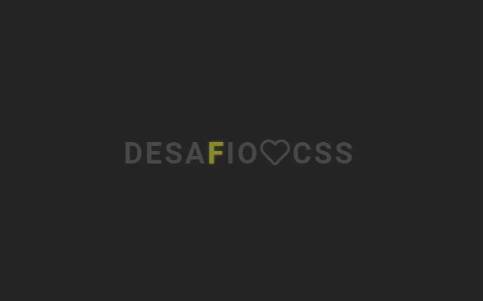

# 30 dias de CSS

## Dia 01 - Ícone de mídia social em camadas

## Dia 02 - Loader animado

## Dia 03 - Mudança de cor de texto quando entra em outra div

## Dia 04 - Botão com efeito

## Dia 05 - Efeito pulsar

## Dia 06 - Efeito lightning text

## Dia 07 - Preloader animado 

## Dia 08 - Coração batendo

## Dia 09 - Pendulo de Newton
## Dia 10 - Animação texto alternando
## Dia 11 - Botão com efeito hover
## Dia 12 - Efeito de preenchimento ao passar o mouse
## Dia 13 - Loading com efeito
## Dia 14 - Fundo de texto animado
## Dia 15 - Texto flutuante
## Dia 16 - Botão com efeito
## Dia 17 - Loader animado
## Dia 18 - Texto esfumaçado
## Dia 19 - Efeitos de animação de fundo de partículas
## Dia 20 - Botão com efeito
## Dia 21 - Esferas quicando
## Dia 22 - Icones com efeito
## Dia 23 - Botão com efeito hover
## Dia 24 - Preloader animado
## Dia 25 - Checkbox animado
## Dia 26 - Loading com efeito
## Dia 27 - Efeito pulsar
## Dia 28 - Cor do background mudando
## Dia 29 - Menu responsivo com Media Queries
## Dia 30 - Fogos de artificio
